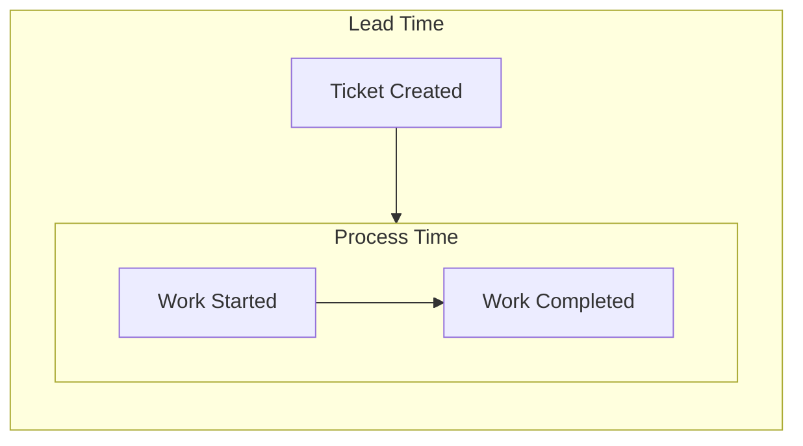
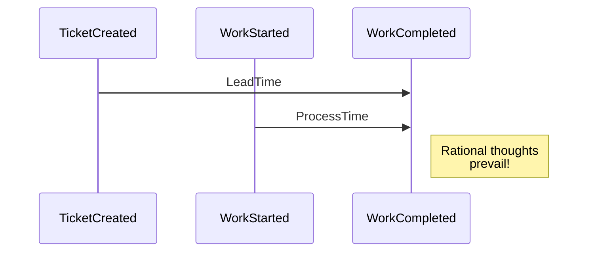

# The DevOps Handbook

## Introduction
The three ways

* The principles of Flow
* The principles of Feedback
* The principles of Continual Learning and Experimentation

```mermaid
graph LR
    subgraph LeadTime[Lead Time]
        ticket[Ticket Created] --> ProcessTime;
        subgraph ProcessTime[Process Time]
            start[Work Started] --> complete[Work Completed];
        end
    end
```

```mermaid
sequenceDiagram
    participant TicketCreated
    participant WorkStarted
    participant WorkCompleted
    TicketCreated->>WorkCompleted: LeadTime
    WorkStarted->>WorkCompleted: ProcessTime
    Note right of WorkCompleted: Rational thoughts <br/>prevail!
```
